# System Architecture & UML Diagrams

Bộ diagram dưới đây được chuẩn hóa cho hệ thống gồm **Frontend, Backend, Mobile, CI/CD, Monitoring, AWS**. Tôi dùng **Mermaid** để bạn có thể render nhanh trong Markdown/Notion/GitHub. Bạn chỉ cần thay tên service, repo, env, queue, database theo hệ thống thực tế.

---

## 1) High-Level Architecture Diagram

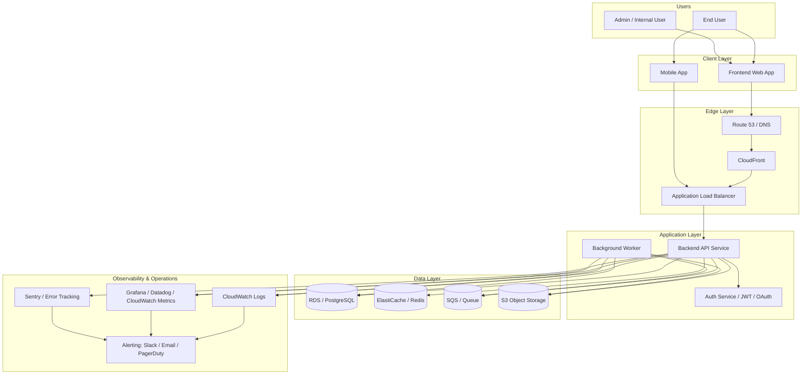

---

## 2) Clean AWS Architecture Diagram

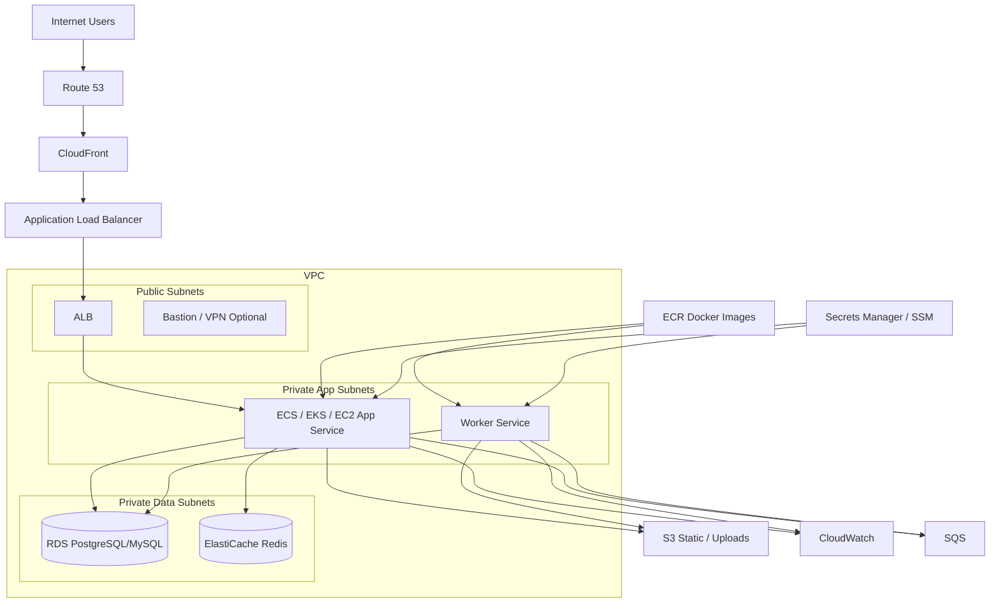

---

## 3) C4-style Container Diagram

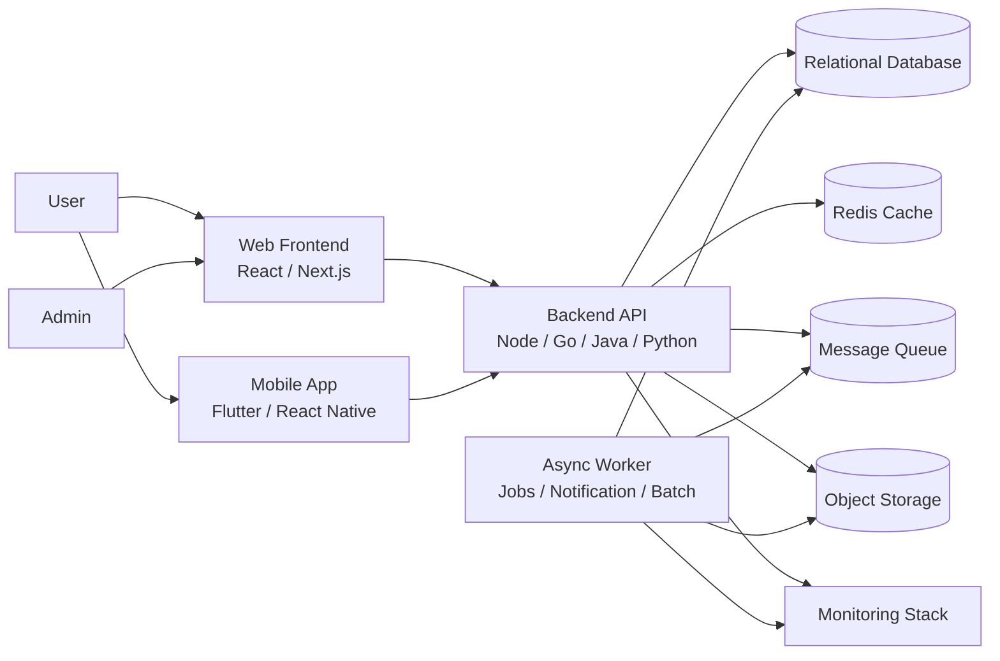

---

## 4) UML Use Case Diagram

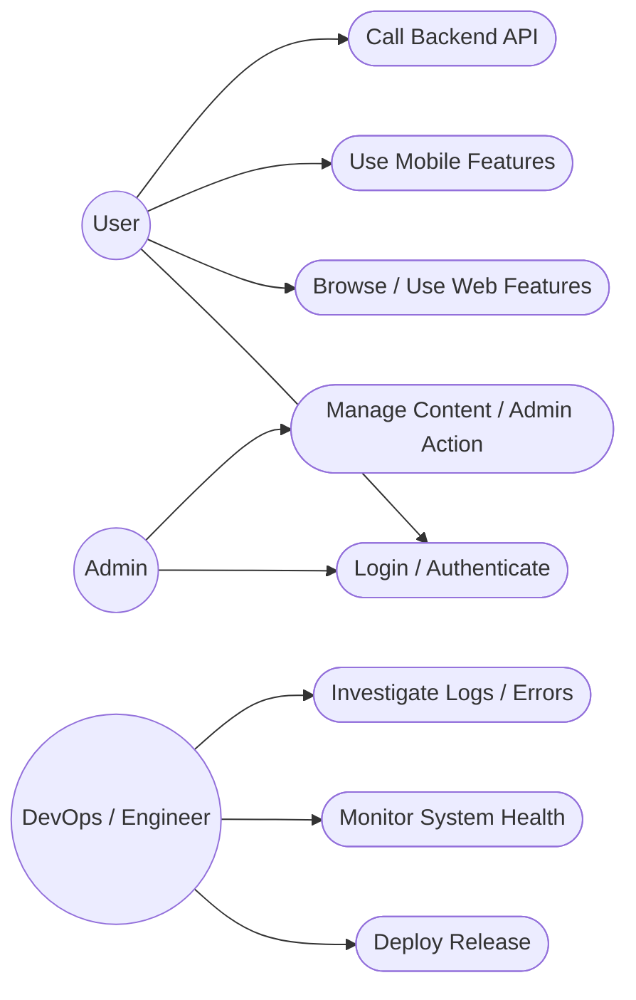

---

## 5) UML Component Diagram

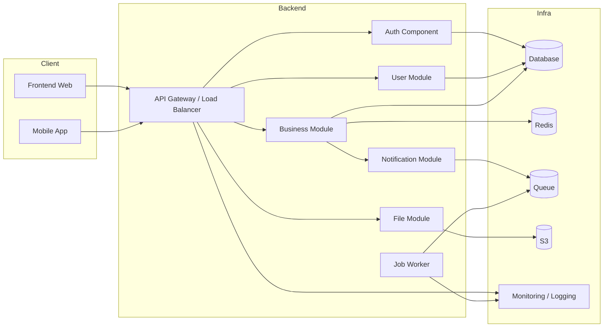

---

## 6) UML Deployment Diagram

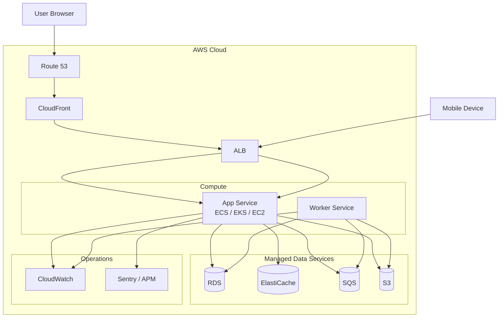

---

## 7) UML Sequence Diagram — User Login Flow

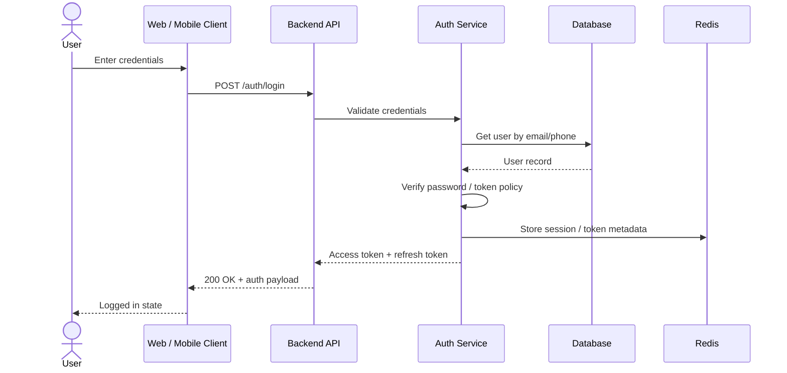

---

## 8) UML Sequence Diagram — Main Business Request

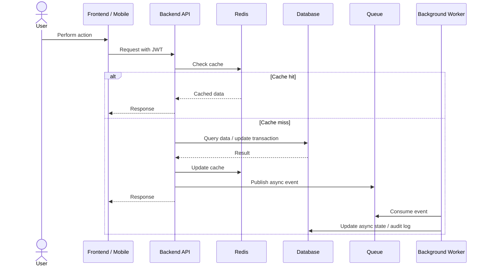

---

## 9) UML Sequence Diagram — CI/CD Flow

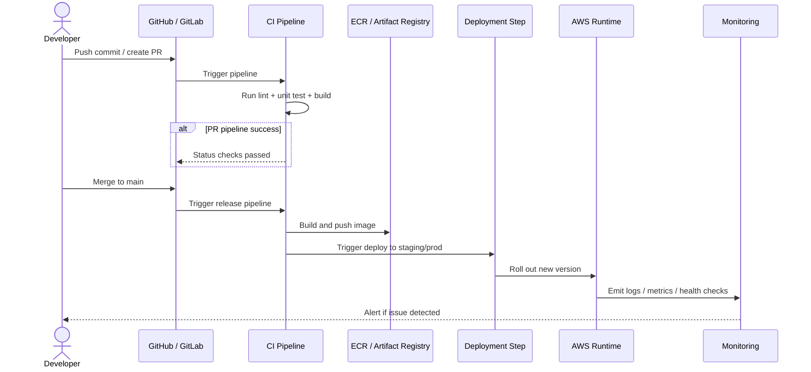

---

## 10) UML Activity Diagram — Release Process

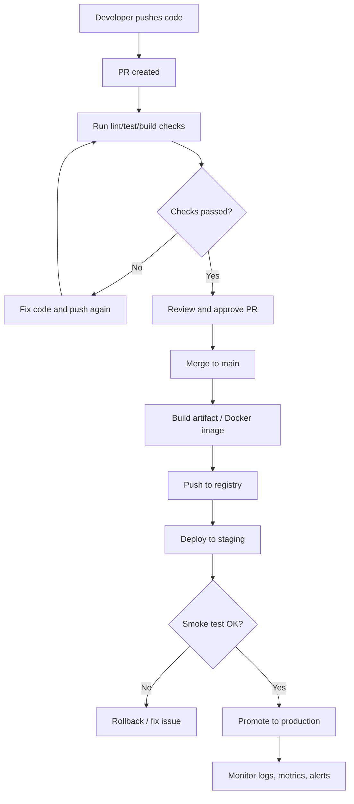

---

## 11) UML State Diagram — Service Health

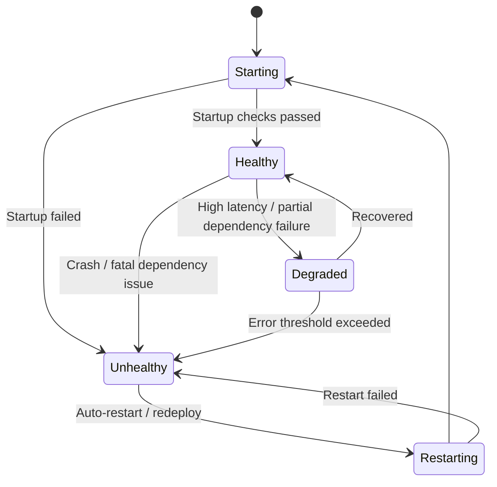

---

## 12) Recommended Naming You Should Replace

* `Frontend Web App` → tên web app thực tế
* `Mobile App` → tên app mobile thực tế
* `Backend API Service` → tên service chính
* `Background Worker` → tên worker / consumer thực tế
* `RDS / PostgreSQL` → loại DB thực tế
* `ElastiCache / Redis` → cache thực tế
* `SQS / Queue` → loại queue thực tế
* `Grafana / Datadog / CloudWatch Metrics` → tool monitoring thực tế
* `Sentry / Error Tracking` → error tracking thực tế

---

## 13) Bộ Diagram Tối Thiểu Nên Dùng Khi Thuyết Trình

Nếu bạn chỉ muốn bộ ngắn, nên dùng đúng 5 diagram này:

1. High-Level Architecture Diagram
2. AWS Architecture Diagram
3. UML Component Diagram
4. UML Sequence Diagram — Main Business Request
5. UML Sequence Diagram — CI/CD Flow

---

## 14) Cách Thuyết Trình Theo Diagram

* Bắt đầu bằng **High-Level Architecture** để định vị các khối lớn.
* Chuyển sang **AWS Architecture** để map ứng dụng vào hạ tầng thực.
* Dùng **Component Diagram** để giải thích phân rã trong backend.
* Dùng **Login Flow** hoặc **Main Business Request** để mô tả runtime.
* Kết thúc bằng **CI/CD Flow** và **Monitoring** để chứng minh vận hành hoàn chỉnh.

---

## 15) Nếu Muốn Chuẩn Hóa Theo Hệ Thống Của Bạn

Hãy thay thế thêm các mục sau:

* FE framework: React / Next.js / Vue
* BE stack: NestJS / Express / Go / Spring / FastAPI
* Mobile stack: Flutter / React Native / native
* Runtime: ECS / EKS / EC2 / Lambda
* Database: PostgreSQL / MySQL / MongoDB
* Queue: SQS / RabbitMQ / Kafka
* Monitoring: Grafana / Datadog / Sentry / CloudWatch
* CI/CD: GitHub Actions / GitLab CI / Jenkins

Khi bạn gửi stack thực tế, tôi có thể chuyển bộ diagram này thành bản **đúng 100% theo hệ thống của bạn**, với tên service, flow và AWS resources cụ thể.
