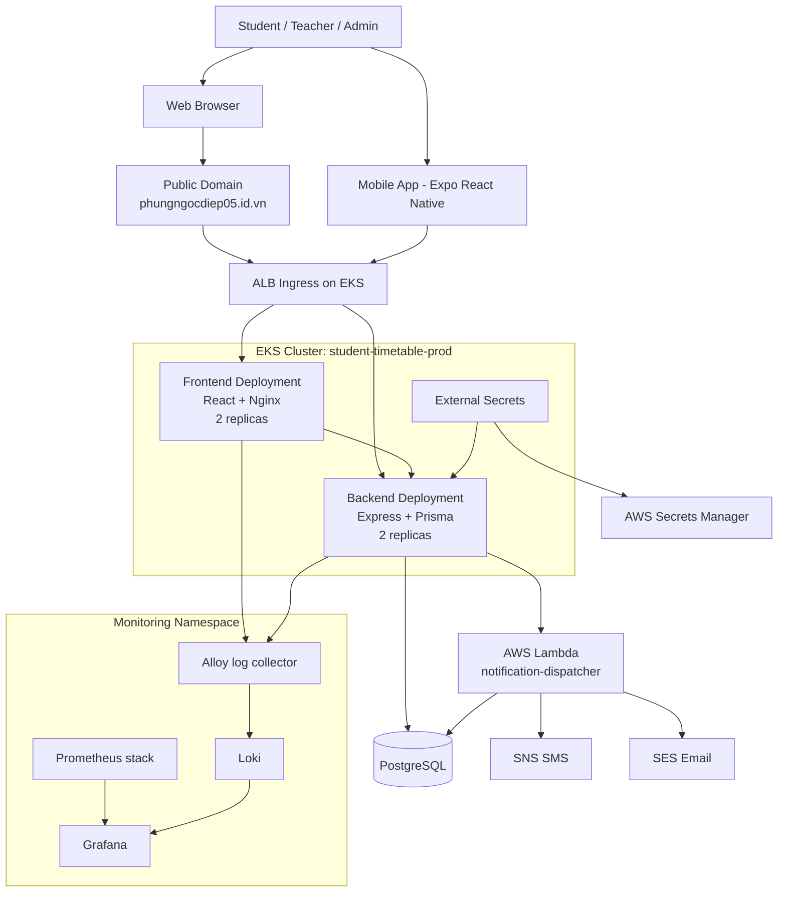
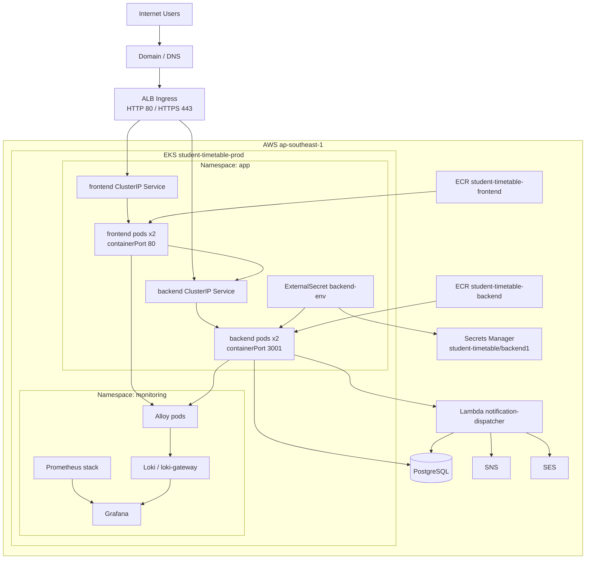
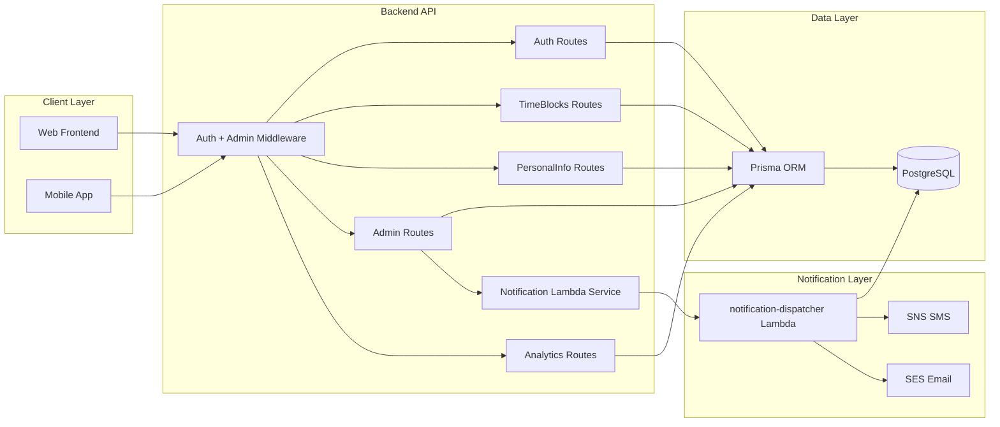
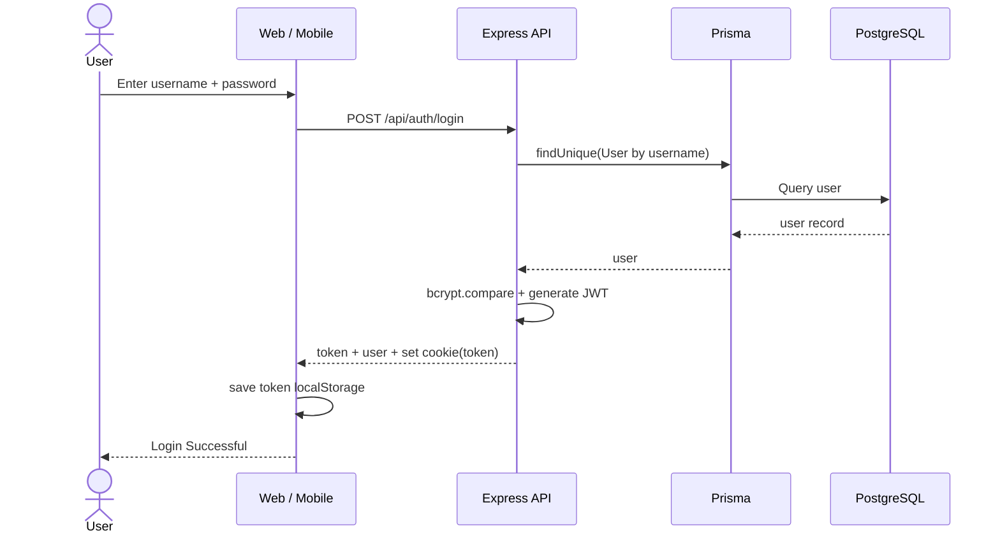
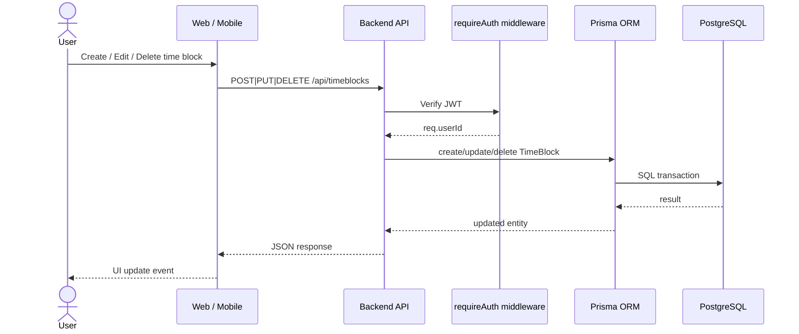
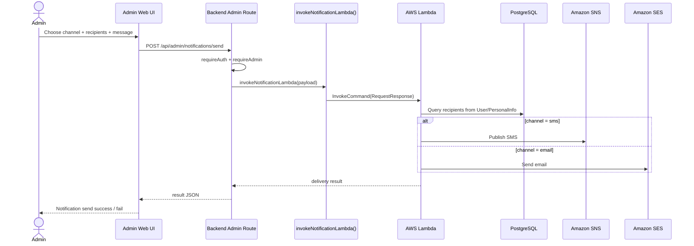
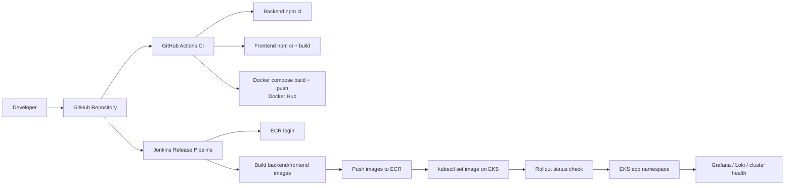
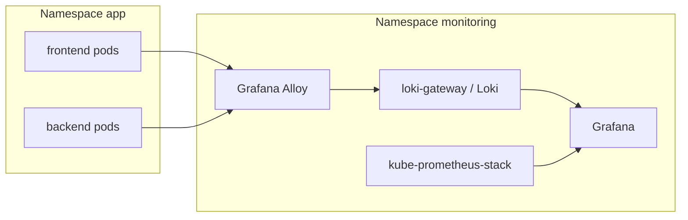

# Student Timetable — Architecture Diagrams

* **Frontend web**: React + Vite + React Router + Tailwind
* **Backend API**: Express 5 + Prisma + PostgreSQL + JWT
* **Mobile app**: Expo / React Native
* **Infra**: AWS EKS + ECR + ALB Ingress + Secrets Manager + External Secrets
* **Monitoring**: kube-prometheus-stack + Grafana + Loki + Alloy
* **Notification**: AWS Lambda calls the backend admin endpoint, sends email via SES
* **CI/CD**: GitHub Actions + Jenkins

---

## 1) Architecture diagram general system 

---

## 2) AWS / Deployment diagram 

---

## 3) UML component diagram 

---

## 4) UML sequence diagram — login flow

---

## 5) UML sequence diagram — Manage timetable / time block

---

## 6) UML sequence diagram — admin sends notification

---

## 7) CI/CD diagram

---

## 8) Monitoring architecture diagram

